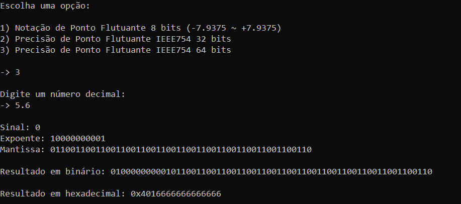

# IEEE 754 Calculator
## Introduction
This program consists on a calculator that converts 10-based rational numbers to binary numbers using either 8 bit Fixed Point Notation or 32/64 bit Floating Point Notation (with IEEE 754 standard) <br><br>
This calculator was built with Python and is a console application.

## How to run

To try out the calculator just download the .py file, go to the respective file directory and use the following command on the terminal (make sure you have Python 3 installed):

on Windows 10/11:<br>
```python .\calculator.py```

## Screenshots

### Fixed point conversion:


### Floating point 32 bit IEEE 754 conversion:


### Floating point 64 bit IEEE 754 conversion:

